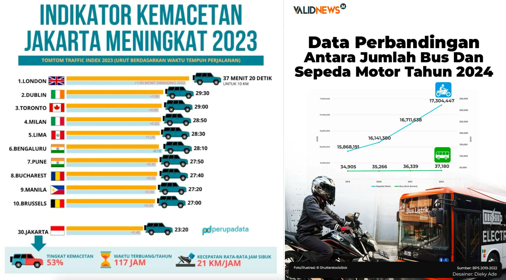

# Pembuka

**Memberikan salam dan berterima kasih**

- Selamat siang, Bapak/Ibu. Terima kasih atas kehadiran Bapak/Ibu semua pada siang hari ini.
- Selamat siang, rekan-rekan. Terima kasih atas kesempatan yang diberikan kepada saya untuk menyampaikan … kepada rekan-rekan semua.
- Selamat siang, teman-teman. Terima kasih karena sudah menyempatkan datang ke ruangan ini untuk mendengarkan pemaparan saya.

**Menyampaikan tujuan**

- Pada siang hari ini, saya akan menyampaikan …
- Pada kesempatan ini, saya akan memaparkan data …
- Siang hari ini, saya akan menjelaskan …

**Memulai presentasi**

- Memulai dengan bertanya -> Ada yang tahu data ini tentang apa?
- Berikut data mengenai …
- Ini adalah data tentang …

# Isi

**Menjelaskan data**

- Tema atau judul
- Selisih jumlah data yang disorot
- Bagian-bagian sumbu datar dan tegak grafik
- Gunakan ungkapan yang dapat menunjukkan kenaikan, penurunan, kestabilan, atau ketidakstabilan.

**Beralih data**

- Mari kita lihat data selanjutnya. …
- Selanjutnya, bagaimana …? Mari kita lihat …
- Sekarang, coba perhatikan data berikutnya. …

**Berpikir/Bertanya**

- Coba bayangkan, dari sekian .... hanya ada ....
- Apakah (situasi ini) bisa/dapat dikatakan (bagus, cukup, berkualitas, dll)
- Apakah data kondisi ini dapat dikatakan baik?

**Memberitahu kejanggalan/masalah**

- Namun, jika dibandingkan dengan ... dan ..., selisihnya cukup banyak.
- Apa masalah yang bisa kita dapat dari data tersebut? Masalahnya adalah ...

# Penutup

**Memberikan kesimpulan atau kecenderungan**

- Dengan demikian, dapat kita simpulkan …
- Dari informasi yang telah disebutkan, kita dapat menyimpulkan …
- Dengan demikian dari data-data tersebut, dapat kita pahami/ketahui bahwa …
- Dari dua data tersebut dapat diketahui ...

**Menyampaikan pesan atau berterima kasih**

- Itulah presentasi saya tentang … . Semoga presentasi ini dapat memberikan manfaat bagi Bapak/Ibu semua.
- Dengan kesimpulan tadi, demikian presentasi saya. Terima kasih sudah mendengarkan presentasi ini. Selamat siang.

# Tanya Jawab

- Demikian presentasi saya. Jika ada yang ingin bertanya, saya persilakan.
- Terima kasih atas pertanyaan Anda, saya akan coba menjawabnya.
- Demikianlah presentasi saya. Semoga ....

# Perhatian

Saya mau presentasi -> Saya ingin mempresentasikan (gunakan kata seformal mungkin)

Tersebut bahwa ada ... -> Disebutkan bahwa ada …

Risk yang semakin besar -> Risiko yang makin besar

2017 -> dua ribu tujuh belas **BUKAN*- dua puluh tujuh belas

2020 -> dua ribu dua puluh

Saya akan menjelas tentang … -> Saya akan menjelaskan …. (jika sudah ada menjelaskan, tidak perlu pakai kata "tentang". Akan tetapi, jika pakai kata "berpresentasi" harus menggunakan kata "tentang")

melonjak sejak pada tahun -> melonjak sejak tahun/melonjak dari tahun

# Latihan

Selamat siang semua! Terima kasih atas kesempatan yang telah diberikan kepada saya untuk berpresentasi hari ini. Hari ini saya akan menjelaskan data tentang kemacetan di Jakarta. Mungkin kalian sudah tahu bagaimana kondisi lalu lintas di Jakarta ya, sangat macet ya. Mari kita lihat grafik di kanan dulu. Grafik ini dari validnews. Sumbu datar menunjukkan tahun pengambilan data dan sumbu tegak menunjukkan jumlah bus dan sepeda motor. Dapat kita lihat dari grafik tersebut, jumlah sepeda motor meningkat bertahap dari tahun 2019 sampai tahun 2022. Sedangkan jumlah bus hanya meningkat sedikit. Tentunya, semakin banyak motor menyebabkan Jakarta lebih macet. Selanjutnya, mari kita lihat diagram di kiri. Berdasarkan diagram ini diperoleh dari perupadata, pada tahun 2023, indikator kemacetan Jakarta meningkat sampai peringkat ketiga puluh. Selain itu, perjalanan sejauh sepuluh kilometer akan memakan waktu lebih dari 23 menit. Setiap tahun kemacetan di Jakarta akan membuang-buang waktu 117 jam. Sangat banyak, kan? Walaupun data ini jauh lebih rendah dibandingkan dengan London atau Milan, tetapi masih lebih lama daripada kira-kira 50 persen negara. Dengan demikian dari data tersebut, dapat kita ketahui bahwa kondisi lalu lintas di Jakarta menjadi lebih parah. Itulah presentasi saya tentang kemacetan di Jakarta. Terima kasih atas perhatiannya. Jika ada yang ingin bertanya, silakan!
