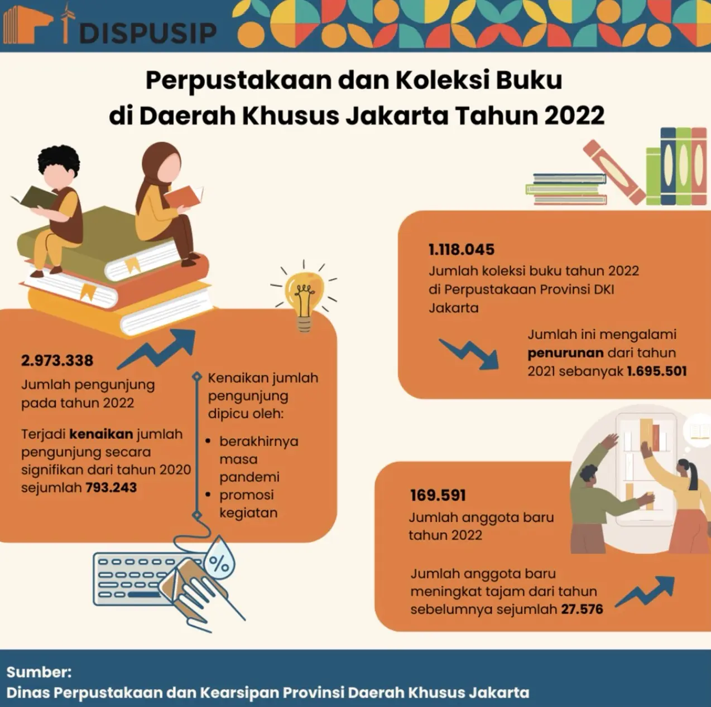
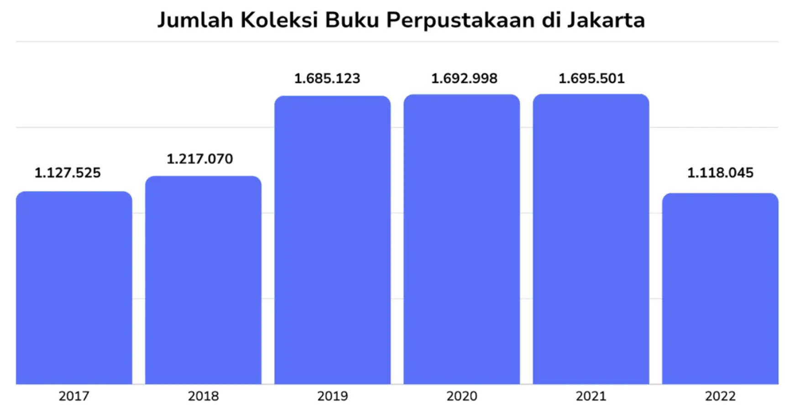
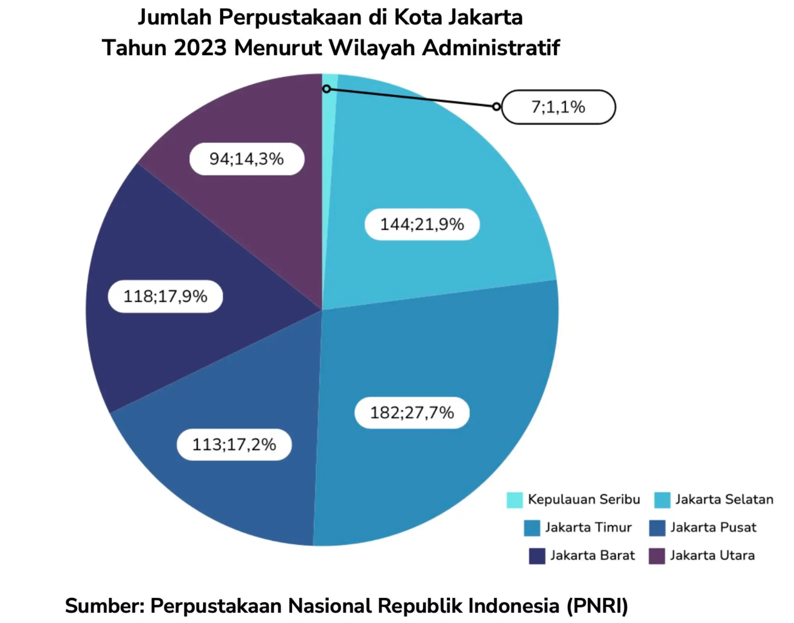
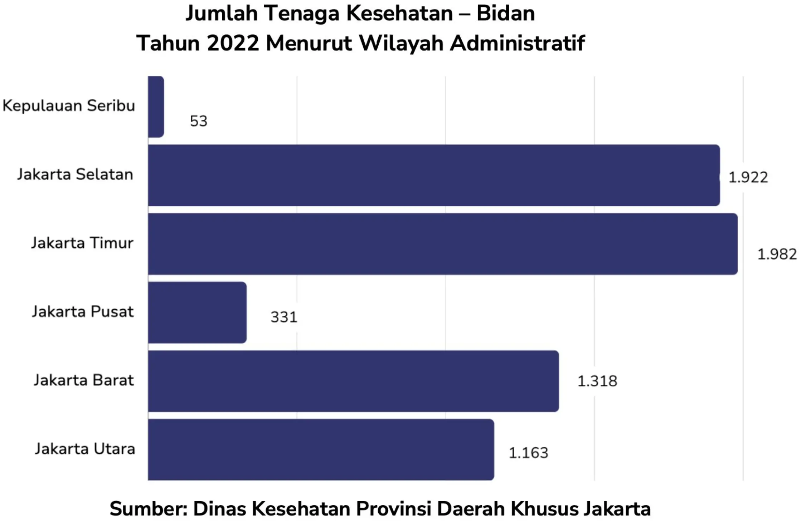

# Infografis

a. Judul atau tema infografis.

b. Perlihatkan kontras data yang disoroti di dalam infografis tersebut (perbedaan yang sangat jauh sehingga terlihat kekurangan yang sangat mencolok).

c. Gunakan kata-kata yang bermakna mengecilkan atau membesarkan.
Contohnya: cuma, hanya, bahkan lebih dari..., jauh lebih (besar/kecil)

d. Gunakan kalimat yang mengajak orang untuk memperbandingkan data yang ada dengan pengetahuan latar umum yang dimiliki pendengar. Contohnya:

- Coba bayangkan, dari sekian .... hanya ada ....
- Pantaskah jika...?
- Apakah bisa dikatakan (bagus, cukup, berkualitas, dll)

e. Kesimpulan dari data-data tersebut.

> a. 信息图的标题或主题。
> b. 突出信息图中数据的对比（差距非常大的地方，使得缺点特别明显）。
> c. 使用具有强调或缩小意义的词语。例如：仅仅，只不过，甚至超过……，远大于（或远小于）。
> d. 使用能够引导观众将数据与其已有背景知识进行比较的句子。例如：
> \- 想象一下，在这么多……中，只有……
> \- 如果这样值得/合适吗？
> \- 是否可以说（好、足够、有质量等）？
> 根据这些数据得出的结论。

**Contoh penyampaian data di dalam infografis:**

Infografis di atas menyoroti jumlah koleksi buku dan pengunjung di Perpustakaan Jakarta pada tahun 2022. Berdasarkan data yang diperoleh dari Dinas Perpustakaan dan Kearsipan Provinsi Daerah Khusus Ibu Kota Jakarta, jumlah pengunjung di Perpustakaan Provinsi Jakarta pada tahun tersebut sebanyak 2.973.338 orang. Jumlah tersebut jauh lebih banyak dibandingkan dengan jumlah pengunjung tahun 2020, yaitu sebanyak 793.243. Kenaikan jumlah tersebut disebabkan berakhirnya masa pandemi dan banyaknya kegiatan menarik pascapandemi di perpustakaan untuk menarik minat calon pengunjung perpustakaan. Kenaikan jumlah pengunjung tersebut juga berdampak pada kenaikan jumlah anggota baru, yaitu 169.591 orang menjadi anggota baru. Jumlah meningkat hampir enam kali lebih banyak dari jumlah anggota baru dari tahun-tahun sebelumnya. Sementara itu, jumlah koleksi buku di perpustakaan Jakarta pada tahun 2022 hanya sebanyak 1.118.045. Jumlah tersebut menurun 577.456 koleksi dari tahun 2021. Namun, apakah angka tersebut bisa dikatakan bagus jika dibandingkan dengan jumlah penduduk Jakarta, yaitu 10,5 juta orang? Berdasarkan data-data tersebut, dapat kita simpulkan bahwa berakhirnya masa pandemi dan banyaknya kegiatan yang diadakan oleh perpustakaan membuat masyarakat tertarik kembali untuk mengunjungi perpustakaan.

> 上述信息图表突出了2022年雅加达图书馆的书籍收藏和访客数量。根据来自雅加达首都特别省档案和图书馆局的数据，雅加达省图书馆在该年的访客数量为2,973,338人。这个数字远高于2020年的访客数量，即793,243人。这一增长归因于疫情结束后，以及图书馆在后疫情时期举办的各种有趣活动，吸引了潜在访客的兴趣。访客数量的增加也带来了新会员数量的增长，新加入的人数为169,591，几乎是前几年新增会员数量的六倍。同时，2022年雅加达图书馆的书籍收藏数量仅为1,118,045册，比2021年减少了577,456册。然而，与雅加达人口数量10,500,000相比，这个数据能否算是令人满意的呢？基于这些数据我们可以总结出，疫情结束后以及图书馆举办的许多活动使人们重新对参观图书馆产生了兴趣。

# Grafik

a. Tema atau judul grafik

b. Bagian-bagian sumbu datar dan tegak grafik

c. Jumlah/nilai/persentase tertinggi atau terendah

d. Gunakan ungkapan yang dapat menunjukkan kenaikan, penurunan, kestabilan, atau ketidakstabilan.

> a. 图表的主题或标题
> b. 图表的水平轴和垂直轴的部分
> c. 最高或最低的数量/值/百分比
> d. 使用可以表示上升、下降、稳定或不稳定的表达。

- Kenaikan
  - meningkat bertahap
  - merangkak naik
  - melonjak
  - meroket
  - meningkat drastis/tajam

> 上升
> \- 逐步增加
> \- 爬升
> \- 激增
> \- 飞速上升
> \- 急剧上升/大幅上涨

- Penurunan
  - menurun bertahap
  - merangkak turun
  - anjlok
  - terpuruk
  - menurun drastis/tajam

> 下降
> \- 逐步下降
> \- 下降
> \- 下跌（贬义）
> \- 跌落（贬义）
> \- 急剧下降/锐减

- Kestabilan
  - stabil
  - tidak ada perubahan berarti
  - menunjukkan kestabilan
  - cenderung stabil

> 稳定
> \- 稳定的
> \- 没有显著变化
> \- 表现稳定性
> \- 趋于稳定

- Ketidakstabilan
  - bergejolak
  - fluktuatif
  - menunjukkan ketidakstabilan

> 不稳定
> \- 动荡的
> \- 波动的
> \- 表现不稳定

e. Informasi data dalam waktu tertentu (ukuran: persen, jiwa, orang, kelas, unit, dsb.)

- mencapai (angka)
- mendekati (angka)
- menembus (angka)
- melampaui (angka)

f. Kaitan antara data yang satu dengan data yang lainnya.

> e. 在特定时间内的数据信息（单位：百分比、人数、个人、班级、单位等）
> \- 达到（数字）
> \- 接近（数字）
> \- 突破（数字）
> \- 超过（数字）
> f. 数据之间的关联。

**Contoh penyampaian data di dalam grafik:**

Grafik di atas menunjukkan jumlah koleksi buku di Perpustakaan Provinsi Daerah Khusus Jakarta. Grafik di atas diperoleh dari Dinas Perpustakaan dan Kearsipan Provinsi Daerah Khusus Jakarta. Sumbu datar menunjukkan tahun pengambilan data dan sumbu tegak menunjukkan jumlah koleksi buku. Berdasarkan grafik tersebut, jumlah koleksi buku merangkak naik dari tahun 2017 sampai tahun 2018. Jumlah tersebut melonjak pada tahun 2019 dan mencapai titik tertinggi pada tahun 2021, yaitu sebanyak 1.692.998 buku. Namun, pada tahun 2022 jumlah koleksi buku anjlok mencapai titik terendah, yaitu 1.118.045. Dengan demikian, dapat disimpulkan bahwa jumlah koleksi buku di Perpustakaan Provinsi DKI cenderung mengalami kestabilan dari tahun 2019—2021 sebelum akhirnya mengalami penurunan yang signifikan pada tahun 2022.

> 上图显示了雅加达特别省省立图书馆的书籍收藏数量。该图表由雅加达特别省图书馆和档案局提供。水平轴表示数据收集的年份，垂直轴表示书籍收藏的数量。根据该图表，书籍收藏数量从2017年到2018年呈现缓慢增长趋势。该数量在2019年激增，并在2021年达到最高点，即1,692,998本。然而，2022年的书籍收藏数量暴跌至最低点，仅为1,118,045本。因此，可以得出结论，雅加达特别省省立图书馆的书籍收藏数量在2019年至2021年期间基本保持稳定，但在2022年出现了显著下降。

# Diagram Lingkaran

a. tema diagram;

b. jumlah yang ditampilkan (dalam angka/persentase);

c. selisih jumlah data yang disorot;

d. kesimpulan dari data-data tersebut.

> a. 图表主题；
> b. 显示的数量（以数字/百分比表示）；
> c. 突出数据的数量差异；
> d. 数据的结论。

**Contoh penyampaian data di dalam diagram lingkaran:**

Diagram lingkaran di atas menunjukkan jumlah titik lokasi perpustakaan di Daerah Khusus Jakarta pada tahun 2023. Berdasarkan diagram dari Perpustakaan Nasional Republik Indonesia, dapat diketahui bahwa perpustakaan terbanyak ada di Jakarta Selatan dengan jumlah 144 atau sebesar 21,9% dari jumlah total perpustakaan di wilayah Jakarta. Sementara itu, perpustakaan keliling terbanyak kedua ada di wilayah Jakarta Timur dengan jumlah 182 atau seperempat lebih banyak dari jumlah total perpustakaan di wilayah Jakarta. Sebaliknya, jumlah perpustakaan keliling paling sedikit ditemukan di daerah Kepulauan Seribu, yaitu sebanyak 7 titik lokasi atau sebesar 1,1% dari jumlah total perpustakaan keliling di wilayah Jakarta. Dengan demikian, jika dibandingkan, selisih antara daerah dengan perpustakaan keliling terbanyak dan yang paling sedikit sangat besar.

> 上面的饼状图显示了2023年雅加达特别地区的图书馆分布点数量。根据印度尼西亚国家图书馆的图表，可以看出，图书馆数量最多的是南雅加达，共有144个，占雅加达地区图书馆总数的21.9%。与此同时，流动图书馆数量第二多的是东雅加达地区，共有182个，比雅加达地区图书馆总数多四分之一。相反，流动图书馆数量最少的是千岛群岛地区，仅有7个分布点，占雅加达地区流动图书馆总数的1.1%。因此，如果进行对比，流动图书馆数量最多的地区与数量最少的地区之间的差距非常大。

# Diagram Batang

a. menyoroti tema data;

b. bagian-bagian sumbu datar dan tegak (jika diagram batang);

c. jumlah (nilai) tertinggi serta terendah;

d. selisih di antara jumlah (nilai);

e. kesimpulan dari data-data.

> a. 突出数据主题；
> b. 横轴和纵轴的部分（如果是柱状图）；
> c. 最高值和最低值；
> d. 数值之间的差距；
> e. 数据的结论。

**Contoh penyampaian data di dalam diagram batang:**

Diagram batang dari Dinas Kesehatan Provinsi Daerah Khusus Jakarta di atas menguraikan enam wilayah administratif dengan jumlah tenaga kesehatan bidan terbanyak pada tahun 2022. Sumbu tegak menunjukkan lokasi, sedangkan sumbu datar menunjukkan jumlah tenaga kesehatan bidan. Berdasarkan diagram batang tersebut, jumlah bidan terbanyak ada di Jakarta Timur, yaitu sebanyak 1.982 orang. Sementara itu, jumlah terbanyak kedua ada di Jakarta Selatan, dengan 1.922 orang atau hanya selisih 60 orang dari wilayah Jakarta Timur. Di posisi ketiga dan keempat ada Jakarta Barat dan Jakarta Utara. Kemudian, di posisi kelima, dengan jumlah bidan sebanyak 331 orang ada di Jakarta Pusat. Sedangkan, jumlah paling sedikit ada di Kepulauan Seribu, yaitu sebanyak 53 orang saja. Dengan demikian, dapat kita ketahui dari diagram tersebut, jumlah bidan di daerah Kepulauan Seribu 85% lebih sedikit daripada di daerah Jakarta Pusat.

> 上面的柱状图来自雅加达特别省卫生局，描述了2022年六个行政区域中助产士数量最多的情况。纵轴表示地点，横轴表示助产士的数量。根据该柱状图，助产士数量最多的是东雅加达，共有1,982人。其次是南雅加达，有1,922人，与东雅加达仅相差60人。排名第三和第四的是西雅加达和北雅加达。接着，排名第五的是中雅加达，助产士数量为331人。而最少的是千岛群岛，仅有53人。因此，从图表中可以看出，千岛群岛的助产士数量比中雅加达少了85%。

# Lebih Lanjut

**Contoh:**

Dapat kita ketahui dari diagram tersebut, masalahnya adalah belum meratanya jumlah bidan pada layanan Kesehatan di Daerah Khusus Jakarta. Jakarta Selatan dan Jakarta Timur menduduki posisi pertama dan kedua. Namun, jika dibandingkan dengan Jakarta Pusat dan Kepulauan Seribu yang memiliki bidan paling sedikit, yaitu sebanyak 331 dan 53, selisihnya cukup banyak. Tentunya, selisih ini tidak dapat dikatakan baik jika pemerintah ingin semua masyarakat memiliki akses yang sama terhadap layanan kesehatan, khususnya ibu hamil. Meskipun demikian, jumlah bidan di keenam daerah tersebut juga berdasarkan jumlah penduduk yang tinggal di daerah tersebut.

> 从该图表中可以看出，问题在于雅加达特别地区的医疗服务中助产士数量分布尚不均衡。南雅加达和东雅加达位居第一和第二。然而，与助产士数量最少的中雅加达和千岛群岛相比，分别为331人和53人，差距相当大。显然，如果政府希望所有民众，特别是孕妇，都能平等地获得医疗服务，这样的差距并不理想。尽管如此，这六个地区的助产士数量也是根据当地居住人口数量来决定的。
