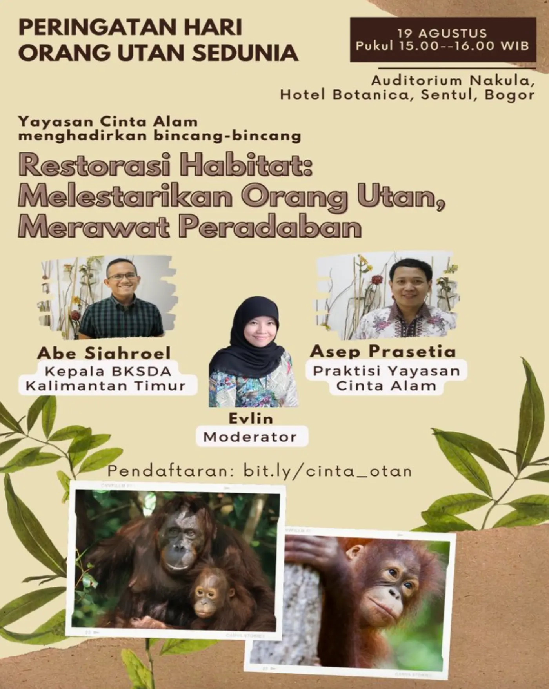

# Membuka Diskusi

## Memberi Salam

**Ungkapan:**

- Selamat pagi/siang/sore, para hadirin sekalian.
- Salam hangat kepada semua peserta diskusi yang telah hadir.
- Terima kasih atas kehadiran Anda semua di acara ini.
- Saya ucapkan selamat datang kepada para pembicara dan peserta diskusi.
- Semoga kita semua dapat menikmati diskusi yang bermanfaat ini.

**Contoh:**

Selamat siang para hadirin sekalian. Para pembicara dan para peserta diskusi kita siang hari ini. Selamat siang juga saya sampaikan kepada Bapak Ruslan, dari Yayasan Cinta Alam, selaku ketua penyelenggara diskusi kita ini, serta teman-teman praktisi, yang sudah berusaha agar acara diskusi kita dapat terlaksana di siang hari yang… tadi, sih, sudah agak mendung, ya?

> 各位来宾，大家中午好。今天中午的各位发言人和讨论参与者们。也向来自Yayasan Cinta Alam的Ruslan先生致以中午的问候，他是本次讨论活动的主办方主席，以及各位实践者朋友们，感谢大家的努力，使得我们的讨论活动能够在今天中午顺利举行……刚才，天好像有点阴，对吧？

Oh, ya, saya juga mau sampaikan salam dan terima kasih juga kepada semua pihak yang telah mendukung acara kita ini; WALHI (Wahana Lingkungan Hidup) Foundation, Majalah Flona, dan TRAVELGODA Tour and Travel. Berkat dukungan merekalah sekarang kita bisa berkumpul bersama untuk saling tukar pandang dan pemikiran siang ini.”

> 哦，对了，我还想向所有支持我们这次活动的各方致以问候和感谢；包括WALHI（Wahana Lingkungan Hidup）基金会、《Majalah Flona》杂志，以及TRAVELGODA Tour and Travel。正是因为他们的支持，我们今天才能聚在一起，在这个中午互相交流观点和想法。”

## Memperkenalkan Diri dan Narasumber

**Ungkapan:**

- Perkenalkan, saya … , moderator diskusi kita hari ini.
- Saya akan memandu diskusi ini selama … .
- Di sebelah kiri saya, telah hadir … .
- Saya juga ingin memperkenalkan … , yang memiliki pengalaman luas di bidang … .
- Terima kasih kepada para narasumber yang telah bersedia hadir dan berbagi wawasan.

**Contoh:**

Hadirin para Peserta diskusi, saya Evlin, pada siang ini saya akan bertindak sebagai moderator diskusi kita. Jadi, saya akan menemani Anda sekalian serta mendampingi para pembicara kita yang sangat luar biasa ini; selama satu jam setengah. Saya akan mencoba terus memandu Anda sekalian dengan baik agar diskusi kita bisa berjalan sesuai yang kita inginkan sehingga kehadiran Anda sekalian di sini akan menjadi manfaat. Saya juga akan mencoba agar kita dapat mengambil banyak info, pandangan, serta wawasan melalui diskusi kita ini, khususnya dari mereka para pembicara kita, yang saat ini telah hadir di hadapan Anda sekalian.

> 各位讨论会的参与者，大家好，我是Evlin，今天中午我将担任我们讨论会的主持人。因此，在接下来的一个半小时里，我将陪伴大家并协助我们这些非常出色的演讲者。我会尽力引导大家，以便我们的讨论能够按照预期进行，使大家的到来有所裨益。我也会努力让我们通过这次讨论获得大量的信息、观点和见解，特别是从我们那些已经在大家面前的演讲者那里。

Dari ujung kiri, telah duduk bersama kita Bapak Asep Prasetia, praktisi Yayasan Cinta Alam, khususnya dalam kaitan pengembalian fungsi hutan di Indonesia bagian Timur. Selamat siang, Pak.

> 从左边起，与我们同坐的是Bapak Asep Prasetia，Yayasan Cinta Alam的实践者，特别是在恢复印尼东部地区森林功能方面。下午好，Pak。

Di sebelah Bapak Asep, juga sudah hadir Bapak Abe Sjahroel, Kepala BKSDA Kalimantan Timur. Tentu saja, sebagai Kepala BKSDA, Pak Abe sangat paham dengan kondisi satwa langka di daerah Kalimantan Timur, termasuk orang utan juga, ya, Pak? … Terimakasih, Pak, sudah mau datang jauh-jauh dari Kalimantan, ya, Pak.

> 在Bapak Asep旁边，同样也已经到场的是Bapak Abe Sjahroel，东加里曼丹BKSDA的负责人。当然，作为BKSDA的负责人，Pak Abe非常了解东加里曼丹地区的珍稀动物状况，包括猩猩，是吧，Pak？……非常感谢您，Pak，愿意从加里曼丹远道而来，Pak。

## Menyampaikan Pengantar Topik

**Ungkapan:**

- Satu hal yang kita ketahui bersama, …
- Seperti yang selama ini kita ketahui, …
- Seperti Anda sekalian ketahui, …
- Anda sekalian tentu tahu/paham bahwa …

**Contoh:**

Hadirin sekalian, seperti yang kita ketahui bersama, orang utan menghabiskan sebagian besar waktunya di hutan tropis, yang kita anggap sebagai paru-paru bumi ini. Sama seperti orang utan yang sangat bergantung pada keberadaan hutan, hutan pun memerlukan keberadaan mereka. Tanpa orang utan, hutan tidak dapat beregenerasi, terancam kehilangan ratusan spesies tanaman dan hewan lain yang hidup berdampingan dengan orang utan. Itulah mengapa orang utan disebut sebagai umbrella species.

> 各位来宾，如我们所知，猩猩大部分时间都生活在热带雨林中，我们将其视为地球的肺。就像猩猩非常依赖森林的存在一样，森林也需要它们的存在。没有猩猩，森林无法再生，面临失去数百种与猩猩共存的植物和其他动物物种的威胁。这就是为什么猩猩被称为“伞物种”的原因。

Di sisi lain, kita juga menyadari satu hal; negeri ini juga sedang berpacu untuk membangun dan memperluas lahan investasi. Semua demi kemakmuran bangsa ini. Akibatnya, tidak sedikit lahan hutan yang tadinya merupakan habitat bagi orang utan, telah beralih fungsi menjadi lahan industri atau hunian. Hal ini akhirnya memunculkan banyak masalah. Orang utan akhir-akhir ini banyak ditemukan di area pertambangan atau permukiman untuk mencari makanan. Puncaknya, hal ini berujung pada kematian orang utan. Tidak sedikit imbauan atau tekanan terhadap pemerintah untuk merestorasi hutan-hutan tersebut ke fungsi awalnya sebagai habitat bagi orang utan.

> 另一方面，我们也意识到一个事实；这个国家正在加速建设和扩大投资用地。一切都为了这个国家的繁荣。结果，许多原本是猩猩栖息地的森林用地已经转变为工业或居住用地。这最终引发了许多问题。最近，猩猩经常被发现出现在矿区或居民区寻找食物。最终，这种情况导致了猩猩的死亡。针对政府要求或施压恢复这些森林原本作为猩猩栖息地功能的呼声也不少……

## Memulai Diskusi

**Ungkapan:**

- Bagaimana kondisi harimau saat ini? mungkin saya mulai dari Bapak … dulu.
- Baik, saya mulai bertanya kepada Bapak … dulu. Sebenarnya, apa sih yang terjadi dengan harimau?
- Baiklah, para hadirin sekalian, mari kita mulai saja diskusi hari ini, …
- Hadirin sekalian, kita mulai saja diskusi kita ini, …
- Baiklah, saya akan mulai diskusi kita ini, …

**Contoh:**

Hadirin sekalian, saya akan langsung mulai saja diskusi kita dengan meminta Bapak Asep menjelaskan pada kita seberapa pentingkah sebenarnya mempertahankan atau merestorasi habitat bagi orang utan saat ini. Bagaimana ini, Pak?

> 各位来宾，我将直接开始我们的讨论，请Bapak Asep向我们解释，目前维持或恢复猩猩栖息地的重要性到底有多大。这方面怎样呢，Pak？

## Latihan

Selamat siang para hadirin sekalian. Selamat datang di Balai Pertemuan Kementrian Lingkungan Hidup. Hari ini adalah hari yang istimewa, yaitu Hari Badak Sedunia, yang mengingatkan kita pentingnya menjaga badak. Saya Sean, pada siang ini saya akan bertindak sebagai moderator diskusi. Pada kesempatan yang spesial ini, kita berkumpul untuk mengikuti acara bertema "Habitat Baru bagi Badak Indonesia: Mungkinkah?" Seperti Anda sekalian ketahui, Badak adalah satwa yang sangat berharga, mereka biasanya tinggal di hutan dengan tumbuhan yang lebat. Akan tetapi, sekarang mereka menghadapi berbagai ancaman serius, seperti kerusakan habitat dan perburuan liar. Apalagi, sulitnya badak berkembang biak menjadi tantangan tambahan yang harus kita hadapi bersama. Sebagai pecinta alam dan peduli lingkungan, kita harus bekerja sama untuk mencari cara agar badak di Indonesia bisa terus hidup. Kita sangat beruntung karena hari ini kita akan mendengar langsung dari dua pembicara ahli. Pertama, Bapak Sukojati dari Kementrian Lingkungan Hidup, dan kedua, Ibu Lidya Nurani dari WWF Indonesia. Mereka sudah sangat berpengalaman dalam penelitian kehidupan badak. Mereka akan berbagi pandangan, pengalaman, dan ide-ide yang sangat berharga untuk membantu kita memahami tantangan dan solusi terkait pelestarian badak. Mari kita mulai acara ini dengan semangat dan penuh perhatian. Terima kasih.
